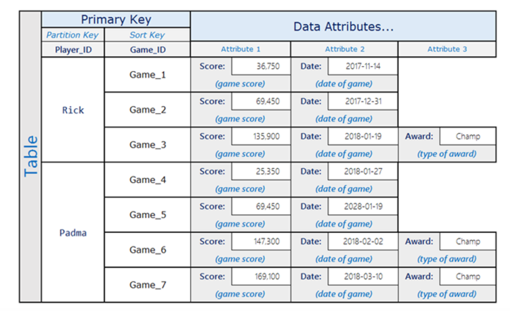
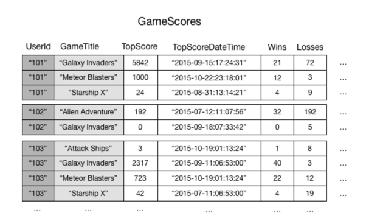
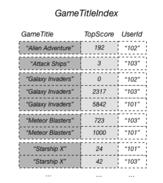
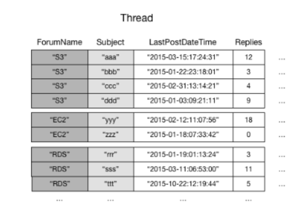
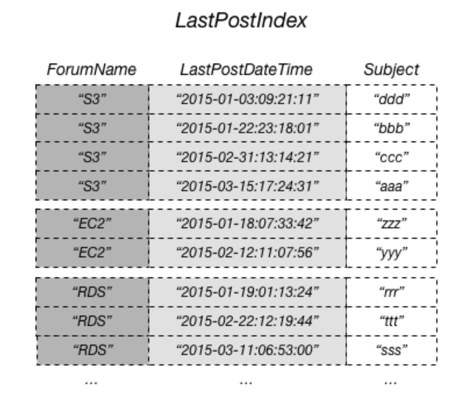

AWS DynamoDB

好的数据库引擎 

    • 高性能
    • 可用性
    • 可恢复性

<h1>数据库分类 </h1>
<h2>关系型数据库</h2>（Relational Database Management Systems -RDBMS）  
Mysql, SQL Server, Oracle, PostgressSQL,H2   
关系模型可以简单理解为二维表格模型，而一个关系型数据库就是由二维表及其之间的关系组成的一个数据组织。  

<h2>非关系型数据库</h2>
（NoSQL Hbase, MongoDB, Amazon DynamoDB,Redis  
NoSQL仅仅是一个概念，泛指非关系型的数据库，区别于关系数据库，它们不保证关系数据的ACID特性
<h2>关系数据设计和 NoSQL 之间的区别</h2>
关系数据库系统 (RDBMS) 和 NoSQL 数据库各有优劣：

    •   在 RDBMS 中，可以灵活查询数据，但查询成本相对较高，不能很好地扩展适应高流量情况。
    •   在 NoSQL 数据库（如 DynamoDB）中，高效查询数据的方式有限，此外查询成本高且速度慢。

这些区别使得这两个系统的数据库设计不同：

    • 在 RDBMS 中，针对灵活性设计，不必担心实现细节或性能。查询优化通常不会影响架构设计，但标准化很重要。
    • 在 DynamoDB 中，对架构进行专门设计，尽可能快速低成本实现最常见和最重要的查询。根据业务使用案例的具体要求定制数据结构。

<h1>NoSQL 设计的两个重要概念</h1>  
NoSQL 设计需要不同于 RDBMS 设计的思维模式。对于 RDBMS，可以创建标准化数据模型，不考虑访问模式。以后出现新问题和查询要求后，进行扩展。
可以将每种类型的数据整理到各自的表中。

<h2>NoSQL 设计的不同之处 </h2>

    • 相比之下，应该先了解需要解答的问题，然后再开始设计 DynamoDB 架构。事先了解业务问题和应用程序使用案例十分重要。  
    • 应在 DynamoDB 应用程序中保留尽可能少的表。  

<H1>DynamoDB</H1>

> 在2004年的时候， Amazon 发现 Oracle 数据库都不够用了。为了还能继续做生意。 AWS设计了一个 Key-Vale 存储系统。以希望能达到以下目的：高性能，可扩展性，可靠性 Amazon DynamoDB 是一种完全托管的 NoSQL 数据库服务，提供快速而可预测的性能，能够实现无缝扩展。DynamoDB 可以从表中自动删除过期的项，从而帮助您降低存储用量，减少用于存储不相关数据的成本

Tables are the fundamental data structures in relational databases and in Amazon DynamoDB. A relational database
management system (RDBMS) requires you to define the table's schema when you create it. In contrast, DynamoDB tables are
schemaless—other than the primary key, you do not need to define any extra attributes or data types when you create a
table.

<b>SQL</b>

``` jql
CREATE TABLE Music (
    Artist VARCHAR(20) NOT NULL,
    SongTitle VARCHAR(30) NOT NULL,
    AlbumTitle VARCHAR(25),
    Year INT,
    Price FLOAT,
    Genre VARCHAR(10),
    Tags TEXT,
    PRIMARY KEY(Artist, SongTitle)
);
```

<b>DynamoDB</b>

``` js
{
    TableName : "Music",
    KeySchema: [
        {
            AttributeName: "Artist",
            KeyType: "HASH", //Partition key
        },
        {
            AttributeName: "SongTitle",
            KeyType: "RANGE" //Sort key
        }
    ],
    AttributeDefinitions: [
        {
            AttributeName: "Artist",
            AttributeType: "S"
        },
        {
            AttributeName: "SongTitle",
            AttributeType: "S"
        }
    ]
}
```

<h2>Core components of Amazon DynamoDB</h2>
In DynamoDB, tables, items, and attributes are the core components that you work with. A table is a collection of items,
and each item is a collection of attributes. DynamoDB uses primary keys to uniquely identify each item in a table and
secondary indexes to provide more querying flexibility. You can use DynamoDB Streams to capture data modification events
in DynamoDB tables.

<h3>Tables</h3>
Similar to other database systems, DynamoDB stores data in tables. A table is a collection of data. For example, see the
example table called People that you could use to store personal contact information about friends, family, or anyone
else of interest. You could also have a Cars table to store information about vehicles that people drive

<h3>Items</h3>
Each table contains zero or more items. An item is a group of attributes that is uniquely identifiable among all of the
other items. In a People table, each item represents a person. For a Cars table, each item represents one vehicle. Items
in DynamoDB are similar in many ways to rows, records, or tuples in other database systems. In DynamoDB, there is no
limit to the number of items you can store in a table

<h3>Attributes</h3>
Each item is composed of one or more attributes. An attribute is a fundamental data element, something that does not
need to be broken down any further. For example, an item in a People table contains attributes called PersonID,
LastName, FirstName, and so on. For a Department table, an item might have attributes such as DepartmentID, Name,
Manager, and so on. Attributes in DynamoDB are similar in many ways to fields or columns in other database systems

<h3>Partition key</h3>
When you create a table, in addition to the table name, you must specify the primary key of the table. The primary key
uniquely identifies each item in the table, so that no two items can have the same key.

<h4>DynamoDB supports two different kinds of primary keys：</h4>

<b>Partition key</b> - A simple primary key, composed of one attribute known as the partition key.

<b>Partition key and sort key – </b>
Referred to as a composite primary key, this type of key is composed of two attributes. The first attribute is the
partition key, and the second attribute is the sort key.

DynamoDB uses the partition key value as input to an internal hash function. The output from the hash function
determines the partition (physical storage internal to DynamoDB) in which the item will be stored. All items with the
same partition key value are stored together, in sorted order by sort key value.

In a table that has a partition key and a sort key, it's possible for multiple items to have the same partition key
value. However, those items must have different sort key values.    


<h3>Secondary indexes</h3>
You can create one or more secondary indexes on a table. A secondary index lets you query the data in the table using an
alternate key, in addition to queries against the primary key. DynamoDB doesn't require that you use indexes, but they
give your applications more flexibility when querying your data. After you create a secondary index on a table, you can
read data from the index in much the same way as you do from the table.

<h4>DynamoDB supports two kinds of indexes:</h4>

    •   Global secondary index – An index with a partition key and sort key that can be different from those on the table.
    •   Local secondary index – An index that has the same partition key as the table, but a different sort key.

<h5>全局二级索引(Global secondary index)</h5>
分区键和排序键可与基表中的这些键不同的索引。全局二级索引之所以称为“全局”，是因为索引上的查询可跨过所有分区， 覆盖基表的所有数据。全局二级索引存储在其远离基表的分区空间中，并且独立于基表进行扩展。

Some applications might need to perform many kinds of queries, using a variety of different attributes as query
criteria. To support these requirements, you can create one or more global secondary indexes and issue Query requests
against these indexes in Amazon DynamoDB.

<h6>Scenario: Using a Global Secondary Index</h6>
To illustrate, consider a table named GameScores that tracks users and scores for a mobile gaming application. Each item
in GameScores is identified by a partition key (UserId) and a sort key (GameTitle). The following diagram shows how the
items in the table would be organized. (Not all of the attributes are shown.).   

Now suppose that you wanted to write a leaderboard application to display top scores for each game. A query that
specified the key attributes (UserId and GameTitle) would be very efficient. However, if the application needed to
retrieve data from GameScores based on GameTitle only, it would need to use a Scan operation. As more items are added to
the table, scans of all the data would become slow and inefficient. This makes it difficult to answer questions such as
the following:

> What is the top score ever recorded for the game Meteor Blasters?   
> Which user had the highest score for Galaxy Invaders?   
> What was the highest ratio of wins vs. losses?

To speed up queries on non-key attributes, you can create a global secondary index. A global secondary index contains a
selection of attributes from the base table, but they are organized by a primary key that is different from that of the
table. The index key does not need to have any of the key attributes from the table. It doesn't even need to have the
same key schema as a table.

For example, you could create a global secondary index named GameTitleIndex, with a partition key of GameTitle and a
sort key of TopScore. The base table's primary key attributes are always projected into an index, so the UserId
attribute is also present. The following diagram shows what GameTitleIndex index would look like.    



Every global secondary index must have a partition key, and can have an optional sort key. The index key schema can be
different from the base table schema.

> In a DynamoDB table, each key value must be unique. However, the key values in a global secondary index do not need to be unique.

<h5>本地二级索引(Local secondary index)</h5>
Some applications only need to query data using the base table's primary key. However, there might be situations where
an alternative sort key would be helpful. To give your application a choice of sort keys, you can create one or more
local secondary indexes on an Amazon DynamoDB table and issue Query or Scan requests against these indexes

<h6> Scenario: Using a Local Secondary Index </h6>
Below is Thread table:   



Some requests might require more complex data access patterns. For example:

> Which forum threads get the most views and replies?   
Which thread in a particular forum has the largest number of messages?   
How many threads were posted in a particular forum within a particular time period?

To answer these questions, the `Query` action would not be sufficient. Instead, you would have to `Scan` the entire
table. For a table with millions of items, this would consume a large amount of provisioned read throughput and take a
long time to complete.

However, you can specify one or more local secondary indexes on non-key attributes, such as `Replies`
or `LastPostDateTime`.

A local secondary index maintains an alternate sort key for a given partition key value. A local secondary index also
contains a copy of some or all of the attributes from its base table. 

Suppose that an application needs to find all of the threads that have been posted within the last three months in a
particular forum. Without a local secondary index, the application would have to `Scan` the entire Thread table and
discard any posts that were not within the specified time frame. With a local secondary index, a `Query` operation could
use `LastPostDateTime` as a sort key and find the data quickly.

The following diagram shows a local secondary index named LastPostIndex. Note that the partition key is the same as that
of the Thread table, but the sort key is LastPostDateTime.   


参考：
https://docs.aws.amazon.com/amazondynamodb/latest/developerguide/GSI.html
https://docs.aws.amazon.com/amazondynamodb/latest/developerguide/LSI.html


